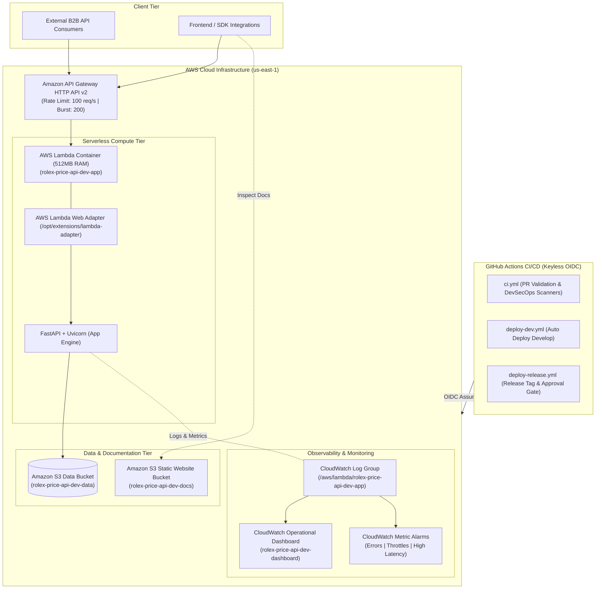

# ⌚ Rolex Price API SaaS — Cloud Engineering Reference Architecture

[](https://github.com/si3mshady/rolex-price-api/actions/workflows/ci.yml)
[](https://www.terraform.io/)
[](docs/security.md)
[](https://www.python.org/)
[](Dockerfile)
[](CHANGELOG.md)
[](LICENSE)

> **A portfolio-grade, production-style serverless SaaS reference implementation demonstrating end-to-end cloud engineering: FastAPI, AWS Lambda Containers, API Gateway v2, Modular Terraform IaC, Keyless OIDC Identity Federation, DevSecOps Scanning, CloudWatch Observability, and Automated S3 Documentation Publishing.**

---

## 📌 Executive Summary

The **Rolex Price API SaaS** originated as an AI-assisted development exercise (inspired by Alfredo Deza's LinkedIn Learning course on turning Kaggle datasets into SaaS applications) and evolved into a production-grade cloud platform reference architecture.

It provides high-performance, real-time REST API access to secondary market pricing, retail valuations, collection breakdowns, and analytics for luxury Rolex timepieces (<500ms p95 latency).

### Key Engineering Capabilities
- **Serverless Compute**: FastAPI application packaged in a multi-stage Docker container (`python:3.12-slim`) executing under non-root `appuser` (UID 10001) using **AWS Lambda Web Adapter** (`v0.8.4`).
- **API Ingress & Protection**: Amazon API Gateway HTTP API (v2) with `$default` auto-deploy stage, default route rate limiting (100 req/sec, 200 burst limit), and environment-aware `X-Api-Key` middleware.
- **Keyless Security**: Zero static AWS credentials in GitHub Secrets; deployment uses **GitHub OpenID Connect (OIDC)** identity federation (`AssumeRoleWithWebIdentity`).
- **Infrastructure as Code**: Modular Terraform (v1.5.7) with two-stage apply patterns, S3 remote state storage, and DynamoDB distributed state locking.
- **Shift-Left DevSecOps**: Non-blocking CI security scanning (`pip-audit`, `Checkov`, `Trivy`) integrated into GitHub Actions pull request validation.
- **SRE & Observability**: Automated CloudWatch log groups, operational dashboard (`rolex-price-api-dev-dashboard`), metric alarms (`Errors`, `Throttles`, `Duration`), and 99.9% availability SLO error budget frameworks.
- **Deployable Documentation Site**: Automated generation of static Swagger UI web bundles (`scripts/generate_docs.py`) synced to a public S3 static website hosting bucket (`rolex-price-api-dev-docs`) post-deployment.

---

## 🏗️ Deployed System Architecture



---

## 📂 Repository Structure

```
rolex-price-api/
├── .github/workflows/    # CI/CD Workflows (ci.yml, deploy-dev.yml, deploy-release.yml)
├── app/                  # FastAPI Application (Routers, Schemas, Services, Config)
│   ├── models/           # Domain entity data models
│   ├── routers/          # API route handlers (health, watches, collections, search, stats)
│   ├── schemas/          # Pydantic v2 validation & serialization schemas
│   └── services/         # Business domain logic (RolexService)
├── data/                 # JSON watch catalog dataset assets (rolex_watches.json)
├── docs/                 # Production Engineering & Operating Documentation
│   ├── ENGINEERING_OPERATING_PRINCIPLES.md  # 14 Reusable Operating Principles
│   ├── ENVIRONMENT_PROMOTION_MODEL.md       # Dev -> Staging -> Production Model
│   ├── ENVIRONMENT_DESTROY_GUIDE.md        # FinOps Infrastructure Teardown Guide
│   ├── FINAL_PROJECT_HANDOFF.md             # Complete Architecture & Resource Handoff
│   ├── FUTURE_PROJECT_START_TEMPLATE.md     # 13-Stage Universal Project Checklist
│   ├── INTERVIEW_PREPARATION_ROLEX.md       # STAR Stories & Architectural Tradeoffs
│   ├── PROJECT_FINAL_AUDIT.md               # Technical Evolution & Retrospective
│   ├── sre-slos.md                         # SLIs, SLOs, and Error Budget Framework
│   └── security.md                          # DevSecOps Policy & API Key Controls
├── scripts/              # Operational & CLI Tooling
│   ├── generate_docs.py  # Static Swagger UI documentation generator
│   ├── smoke_test.py     # End-to-end payload & documentation smoke tester
│   └── destroy-environment.sh # Guided infrastructure teardown script
├── skills/               # AI Agent Guardrails & Specification Files
├── terraform/            # Infrastructure as Code (Modules & Dev/Prod Environments)
│   ├── bootstrap/        # S3 Remote State Bucket & DynamoDB Lock Table IaC
│   ├── environments/     # Dev and Prod Environment Entrypoints
│   └── modules/          # Reusable Modules (api_gateway, cloudwatch, ecr, iam, lambda, s3, s3_website)
├── tests/                # Pytest Test Suites (44 unit/integration tests passing)
├── CHANGELOG.md          # Release History adhering to Keep a Changelog & SemVer (v1.0.0)
├── Dockerfile            # Multi-stage container build with AWS Lambda Web Adapter
├── pytest.ini            # Pytest configuration settings
├── requirements.txt      # Pinned Python production dependencies
└── README.md             # Primary repository documentation
```

---

## 🛠️ Technology Stack & Platform Pillars

| Category | Technology / Tooling | Implementation Details |
| :--- | :--- | :--- |
| **Compute & Runtime** | Python 3.12, FastAPI, Pydantic v2, AWS Lambda Web Adapter (`v0.8.4`) | Unprivileged Docker container (`USER appuser`, UID 10001) hosted on AWS Lambda (512MB RAM, 30s timeout). |
| **API Ingress** | Amazon API Gateway HTTP API (`v2`) | Auto-deployed `$default` stage, rate limit 100 req/sec, burst limit 200 req, CORS support. |
| **Infrastructure as Code** | Terraform `v1.5.7` | Modular IaC, two-stage apply pattern, remote S3 state storage + DynamoDB distributed state locking. |
| **Identity & Security** | GitHub OIDC, AWS IAM, PyPA `pip-audit`, `Checkov`, `Trivy` | Keyless AWS STS session assumption (`AssumeRoleWithWebIdentity`), environment `X-Api-Key` middleware. |
| **Observability & SRE** | Amazon CloudWatch Logs, Operational Dashboards, Metric Alarms | Alarms for Lambda errors, execution throttles, and p95 latency >1000ms. Defined 99.9% availability SLO. |
| **Docs Publishing** | Python 3.12, Swagger UI CDN (`v5`), Amazon S3 Website | Static Swagger UI bundle (`docs-site/`) generated via `scripts/generate_docs.py` and synced to S3. |
| **Testing Suite** | Pytest, Urllib3 Smoke Tester | 44 unit/integration tests passing; payload-level post-deployment verification (`scripts/smoke_test.py`). |

---

## 🚀 Quickstart & Local Development

### 1. Prerequisites
- Python 3.12+
- Docker Engine 24.0+
- Terraform 1.5.7+
- AWS CLI v2

### 2. Clone Repository & Run Tests
```bash
git clone https://github.com/si3mshady/rolex-price-api.git
cd rolex-price-api
python3 -m venv .venv
source .venv/bin/activate
pip install -r requirements.txt

# Run full test suite (44 passing tests)
pytest -v
```

### 3. Launch Local Container Application
```bash
# Build multi-stage Docker container locally
docker build -t rolex-price-api:local .

# Run container on port 8000
docker run -p 8000:8000 rolex-price-api:local

# Execute local container smoke tests
python3 scripts/smoke_test.py --base-url http://localhost:8000
```

---

## 🌐 Deployed Endpoints & Live Testing

```bash
# 1. API Gateway Base Endpoint
export API_URL="https://law69ha149.execute-api.us-east-1.amazonaws.com"

# 2. Health Liveness & Catalog Status
curl -s "$API_URL/health" | jq .

# 3. Watch Catalog Listing
curl -s "$API_URL/watches?limit=5" | jq .

# 4. Collections Breakdown
curl -s "$API_URL/collections" | jq .

# 5. Market Valuation Statistics
curl -s "$API_URL/statistics" | jq .

# 6. Live S3 Static Documentation Website
curl -I "http://rolex-price-api-dev-docs.s3-website-us-east-1.amazonaws.com"
```

---

## 📖 Primary Documentation Index

- [📘 Engineering Operating Principles](docs/ENGINEERING_OPERATING_PRINCIPLES.md): 14 reusable principles extracted from this project.
- [🚀 Environment Promotion Model](docs/ENVIRONMENT_PROMOTION_MODEL.md): Dev ➡️ Staging ➡️ Production deployment lifecycle runbook.
- [🧹 Infrastructure Teardown Guide](docs/ENVIRONMENT_DESTROY_GUIDE.md): Safe FinOps teardown procedures via `scripts/destroy-environment.sh`.
- [🎯 Senior Interview Preparation](docs/INTERVIEW_PREPARATION_ROLEX.md): Criteria self-audit, STAR stories, and architectural Q&A.
- [📐 Universal Project Start Template](docs/FUTURE_PROJECT_START_TEMPLATE.md): 13-stage project delivery lifecycle checklist.
- [🏁 Final Project Handoff](docs/FINAL_PROJECT_HANDOFF.md): Complete system handoff, AWS resource map, and lessons learned.
- [📊 SRE & SLO Framework](docs/sre-slos.md): Service level indicators, objectives, error budgets, and CloudWatch metrics.
- [🛡️ DevSecOps & Security Policy](docs/security.md): Keyless OIDC identity, API key controls, and scanning policies.

---

## ⚖️ License

Distributed under the MIT License. See [`LICENSE`](LICENSE) for more information.
