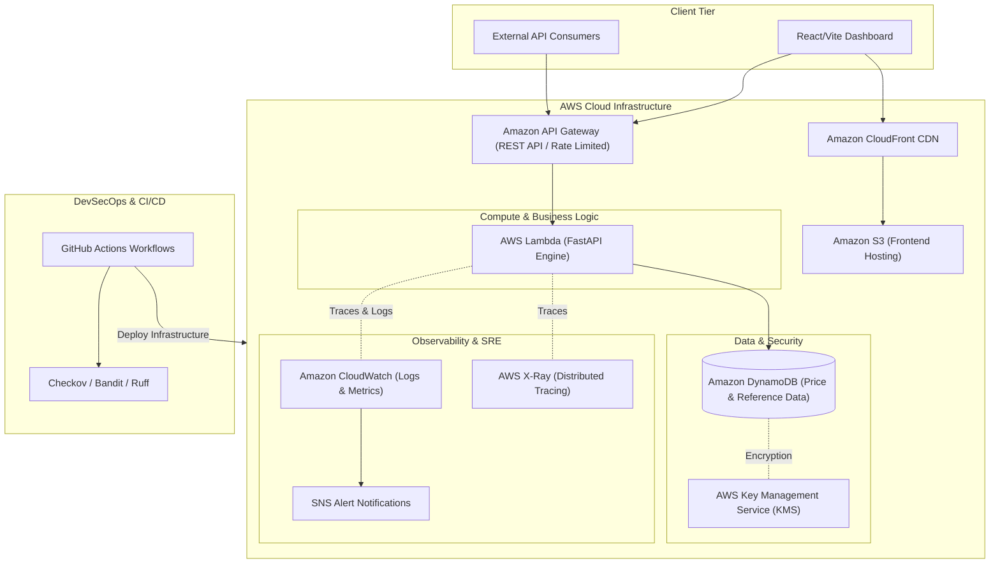

# ⌚ Rolex Price API & Analytics SaaS Platform

[](https://github.com/si3mshady/rolex-price-api/actions/workflows/ci.yml)
[](https://www.terraform.io/)
[](docs/security.md)
[](https://www.python.org/)
[](LICENSE)
[](https://github.com/astral-sh/ruff)

> **Enterprise-grade, production-ready serverless SaaS solution for real-time tracking, historical valuation analytics, and market trends of luxury Rolex timepieces.**

---

## 📌 Executive Summary

The **Rolex Price API** is designed as a model production-ready SaaS platform demonstrating modern Software Engineering, AWS Cloud Infrastructure, Infrastructure as Code (Terraform), Automated CI/CD Pipelines (GitHub Actions), DevSecOps security policies, and Site Reliability Engineering (SRE) observability standards.

Key capabilities include:
- High-performance Serverless REST API built with FastAPI and hosted on AWS Lambda behind Amazon API Gateway.
- Low-latency persistence using AWS DynamoDB with single-table design principles and KMS encryption at rest.
- Modern Web Dashboard (Frontend) for real-time luxury watch index visualization and price trend analytics.
- Multi-environment Infrastructure as Code (Terraform) supporting isolated `dev`, `staging`, and `prod` environments.
- Comprehensive DevSecOps pipeline enforcing SAST, IaC security scanning, secret detection, and automated test gates.
- SRE Observability stack with structured logging, custom CloudWatch metrics, trace correlation, and automated alert routing.

---

## 🏗️ High-Level System Architecture



---

## 📂 Repository Structure

```
rolex-price-api/
├── .github/              # GitHub Actions CI/CD workflows, issue/PR templates
│   └── workflows/        # Workflows for CI, DevSecOps scanning, and IaC deployment
├── app/                  # FastAPI backend application (Services, Models, API routes)
├── data/                 # Raw and processed market valuation datasets & seed scripts
├── docs/                 # Project documentation (Architecture, SRE, DevSecOps, Deployment)
├── frontend/             # Single Page Application (SPA) dashboard for analytics
├── scripts/              # Operational, database seed, and developer utility scripts
├── terraform/            # Infrastructure as Code (Modules, Dev, Staging, Prod environments)
├── tests/                # Automated test suite (Unit, Integration, E2E, Contract)
├── .editorconfig         # Code formatting consistency configuration across IDEs
├── .gitignore            # Version control exclusion rules for Python, Terraform, Node, Secrets
├── CONTRIBUTING.md       # Guidelines for code style, branching, PRs, and commit conventions
├── LICENSE               # MIT Open Source License
└── README.md             # Primary repository documentation & overview
```

---

## 🛠️ Technology Stack & Engineering Pillars

| Domain | Technologies & Best Practices |
| :--- | :--- |
| **Backend API** | Python 3.12, FastAPI, Pydantic v2, Mangum (AWS Lambda Adapter), Structlog |
| **Cloud Infrastructure** | AWS Lambda, API Gateway, DynamoDB, CloudFront, S3, KMS, IAM, CloudWatch |
| **Infrastructure as Code** | Terraform `^1.7`, Modular architecture, Remote S3 State Backend + DynamoDB Locking |
| **Frontend** | React / Vite, TypeScript / JS, TailwindCSS / CSS3, Recharts Analytics |
| **DevSecOps** | GitHub Actions, Bandit (SAST), Checkov (IaC Scan), Ruff (Linter/Formatter), MyPy |
| **SRE & Operations** | CloudWatch Alarms, Structured JSON Logs, Distributed Tracing (X-Ray), Synthetic Canaries |
| **Testing** | Pytest, Pytest-Cov, Moto (AWS Mocking), Locust (Load Testing) |

---

## 🎯 Site Reliability Engineering (SRE) & Operational Goals

This project targets strict operational and availability benchmarks:

- **Service Level Objective (SLO - Availability)**: 99.9% uptime for API Gateway & Lambda endpoints over a rolling 30-day window.
- **Service Level Objective (SLO - Latency)**: 95th percentile (P95) latency < 250ms for `GET /v1/prices` requests.
- **Error Budget Policy**: Automated CI deployment freezes if error budget burn rate exceeds 2% in 1 hour.
- **Observability**: Standardized structured JSON logs with correlation IDs (`X-Correlation-ID`) across every request context.

---

## 🚀 Quickstart & Local Development

### 1. Prerequisites
Ensure you have the following installed on your developer machine:
- Python 3.12+
- Terraform 1.7+
- Node.js 20+ & npm
- AWS CLI v2 (configured with sandbox credentials)

### 2. Clone the Repository
```bash
git clone https://github.com/si3mshady/rolex-price-api.git
cd rolex-price-api
```

### 3. Verify Code Quality & Static Analysis
```bash
# Run Ruff linting and formatting check
ruff check .
ruff format --check .

# Validate Terraform configurations
terraform -chdir=terraform/environments/dev init -backend=false
terraform -chdir=terraform/environments/dev validate
```

---

## 📖 Documentation Index

Detailed engineering documentation is located in the [`docs/`](docs/) directory:

- [📄 Architecture Blueprint](docs/architecture.md): Detailed cloud topology, data schemas, and API design.
- [🛡️ DevSecOps & Security Policy](docs/security.md): Threat modeling, IAM policies, static analysis, and secrets management.
- [📊 SRE & SLO Framework](docs/sre-slos.md): Service Level Indicators, Objectives, Error Budgets, and Incident Management.
- [🚀 Infrastructure & Deployment Guide](docs/deployment.md): Terraform state management, pipeline steps, and rollback procedures.

---

## 🤝 Contributing

We welcome contributions! Please review [`CONTRIBUTING.md`](CONTRIBUTING.md) for details on our coding standards, branch conventions, and pull request submission process.

---

## ⚖️ License

Distributed under the MIT License. See [`LICENSE`](LICENSE) for more information.
