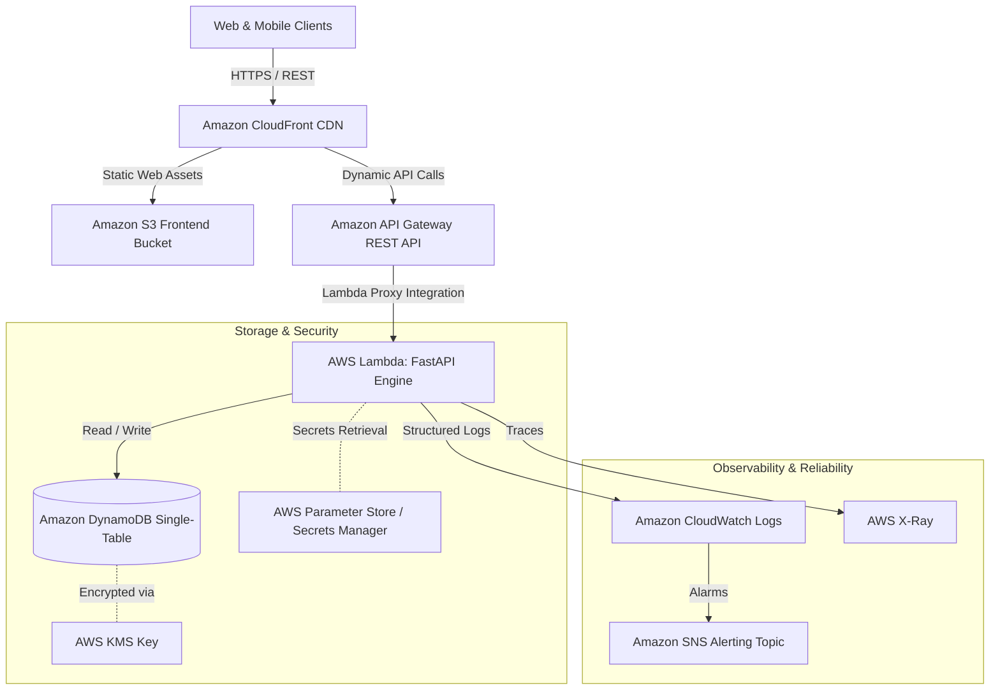

# 📐 System Architecture Blueprint

This document details the architecture, system topology, data flow, and API design of the **Rolex Price API SaaS Platform**.

---

## 🏛️ Architecture Overview

The system is constructed as a modern, cloud-native, serverless web application hosted on AWS. It prioritizes low-latency read operations, automated scaling, cost efficiency, and zero server maintenance overhead.

---

## 🔑 Core Design Principles

1. **Serverless-First**: Micro-compute powered by AWS Lambda and Amazon API Gateway to eliminate idle server costs and provide auto-scaling up to thousands of requests per second.
2. **Single-Table DynamoDB Design**: Optimized data modeling supporting access patterns for time-series valuation data, model references, and historical market metrics.
3. **Stateless API Layer**: Python FastAPI framework packaged as a serverless bundle using Mangum, enabling easy local development and seamless Lambda execution.
4. **Decoupled Frontend**: React/Vite Single Page Application (SPA) static build deployed to Amazon S3 and globally accelerated via Amazon CloudFront.

---

## 📊 Data Model & Access Patterns

### DynamoDB Primary Table (`rolex_price_data`)

- **Partition Key (`PK`)**: Entity Identifier (e.g., `WATCH#Submariner-126610LN`, `SERIES#Daytona`)
- **Sort Key (`SK`)**: Range / Version / Timestamp (e.g., `METADATA`, `VALUATION#2026-08-01`)

### Primary Access Patterns
| Pattern ID | Access Pattern Description | Key Condition | Target Latency |
| :--- | :--- | :--- | :--- |
| **AP-01** | Get Watch Reference Details | `PK = WATCH#<model_id>` AND `SK = METADATA` | < 15ms |
| **AP-02** | Get Price History Time-Series | `PK = WATCH#<model_id>` AND `SK BEGINS_WITH(VALUATION#)` | < 25ms |
| **AP-03** | List All Models in Collection | `GSI1PK = COLLECTION#<name>` | < 35ms |
| **AP-04** | Get Market Index Valuation | `PK = INDEX#ROLEX_COMPOSITE` AND `SK = LATEST` | < 10ms |

---

## 🔌 API Endpoint Specification (Planned Interface)

- `GET /health` - Liveness & Readiness probe (returns API status, DB connectivity, uptime)
- `GET /v1/watches` - Paginated list of indexed Rolex models with latest price estimates
- `GET /v1/watches/{model_id}` - Detailed metadata & specs for a specific timepiece
- `GET /v1/watches/{model_id}/history` - Historical price series data with customizable date ranges
- `GET /v1/analytics/market-index` - Macro Rolex secondary market index & trend calculations
