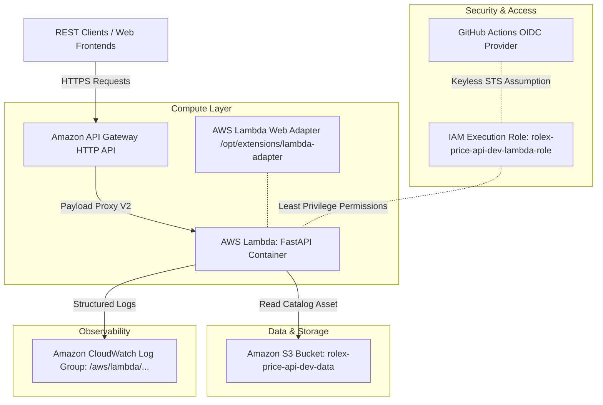

# 📐 System Architecture Blueprint

**Project**: Rolex Price API SaaS  
**Architecture Pattern**: Cloud-Native Serverless HTTP Container  
**Hosting Provider**: Amazon Web Services (AWS)  

---

## 🏛️ System Topology

The **Rolex Price API SaaS** is architected as a lightweight, low-latency, cloud-native serverless web application. It uses a single containerized FastAPI engine packaged with the **AWS Lambda Web Adapter**, fronted by **Amazon API Gateway HTTP API**, and backed by **Amazon S3** static data storage.

---

## 🔑 Key Architectural Components

### 1. API Ingress (Amazon API Gateway HTTP API)
- **Type**: AWS API Gateway v2 HTTP API (`$default` stage).
- **Latency & Cost**: Offers up to 70% lower latency and 70% cost reduction compared to legacy REST APIs.
- **Routing**: Full proxy integration (`ANY /{proxy+}`) routing all HTTP traffic directly to the underlying Lambda container.

### 2. Serverless Compute (AWS Lambda Container + Web Adapter)
- **Base Image**: `python:3.12-slim` multi-stage build.
- **Adapter**: AWS Lambda Web Adapter (`v0.8.4`) embedded at `/opt/extensions/lambda-adapter`. Translates incoming Lambda events into HTTP calls to Uvicorn running on port 8000.
- **Configuration**: 512 MB memory, 30-second timeout, running under unprivileged user `appuser` (UID 10001).

### 3. Data Storage (Amazon S3)
- **Bucket**: `rolex-price-api-dev-data`.
- **Format**: Static JSON time-series and market valuation catalog (`rolex_scraped_dataset.json`). Loaded in-memory on application startup via `RolexService`.

### 4. Security & Identity Federation (GitHub OIDC)
- **Authentication**: Keyless OpenID Connect (OIDC) identity federation (`sts:AssumeRoleWithWebIdentity`). Zero long-lived AWS access keys stored in GitHub Secrets.
- **IAM Policy**: Execution role limited strictly to CloudWatch log stream creation and read access to the designated S3 data bucket.

---

## 📊 Data & Service Flow Sequence

1. **Client Request**: HTTPS REST request received by API Gateway.
2. **Proxy Payload**: API Gateway constructs HTTP payload format v2 and invokes AWS Lambda.
3. **Web Adapter Translation**: The extension interceptor receives the event and sends an internal HTTP request to FastAPI running on `localhost:8000`.
4. **Service Execution**: FastAPI router evaluates query filters (`/watches`, `/collections`, `/search`, `/statistics`) against `RolexService` memory cache.
5. **Structured Response**: HTTP 200/404/422 JSON payload returned to API Gateway and client.
6. **Logging**: Execution metrics and logs streamed to CloudWatch Log Group `/aws/lambda/rolex-price-api-dev-app`.
