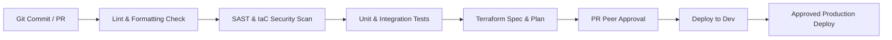

# 🚀 Deployment & Infrastructure Lifecycle Guide

This document outlines the deployment architecture, environment isolated topologies, Terraform state management, and GitHub Actions CI/CD workflows for the **Rolex Price API**.

---

## 🌍 Environment Topology

Infrastructure is structured into three completely isolated environments:

```
rolex-price-api/terraform/
├── modules/               # Reusable infrastructure modules
│   ├── api_gateway/       # API Gateway REST configuration module
│   ├── dynamodb/          # Single-table DynamoDB module with KMS
│   ├── lambda/            # Serverless FastAPI lambda execution module
│   └── monitoring/        # CloudWatch dashboards & alarm module
└── environments/
    ├── dev/               # Development environment (Sandbox)
    ├── staging/           # Pre-production staging environment
    └── prod/              # Production environment (Multi-AZ, high availability)
```

---

## 🔄 CI/CD Pipeline Lifecycle (GitHub Actions)

Every pull request and merge triggers our automated pipeline:



### Pipeline Stages Matrix
1. **Lint & Quality Gate**: Runs `ruff check .` and `mypy app/`.
2. **Security Gate**: Runs `bandit -r app/` and `checkov -d terraform/`.
3. **Automated Test Gate**: Executes `pytest --cov=app tests/` (enforces > 85% coverage).
4. **Terraform Validation & Plan**: Runs `terraform validate` and `terraform plan` generating speculative execution diffs attached to PR comments.
5. **Continuous Deployment**: On merge to `main`, terraform changes are applied and Lambda package artifact is deployed via zero-downtime alias switching.
